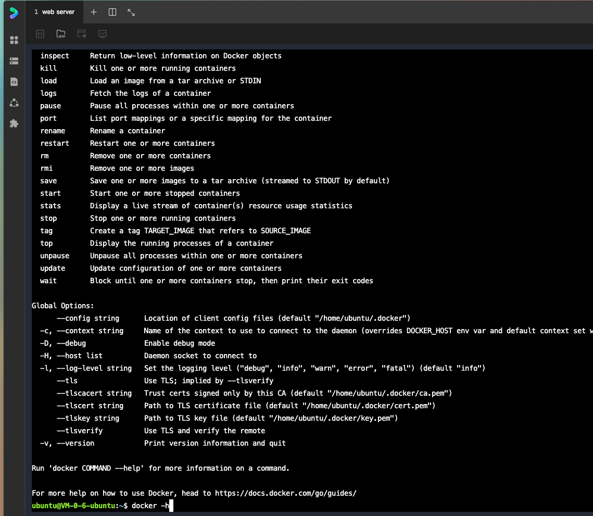

# 执行步骤

## 作业一

> 位置：one

```bash
terraform init # 初始化
terraform plan  # 查看将要执行的操作
terraform apply --auto-approve # 执行 
```

> 然后登陆服务器中查看docker是否已经安装了

截图如下



## 作业2 

> 位置: two

先使用tencent创建cvm并安装k3s 

然后基于k3s 使用yaml进行安装redis

[参考地址](https://marketplace.upbound.io/providers/crossplane-contrib/provider-tencentcloud/v0.8.3/resources/redis.tencentcloud.crossplane.io/Instance/v1alpha1#doc:spec-forProvider-passwordSecretRef)
